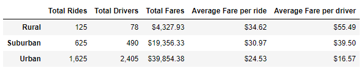

# PyBer_Analysis

## Overview of the analysis

V. Isualize has given you and Omar a brand-new assignment. Using your Python skills and knowledge of Pandas, you’ll create a summary DataFrame of the ride-sharing data by city type. Then, using Pandas and Matplotlib, you’ll create a multiple-line graph that shows the total weekly fares for each city type. Finally, you’ll submit a written report that summarizes how the data differs by city type and how those differences can be used by decision-makers at PyBer.

## Results

In the following summary summary of the ride by city type 
we can see that the Urban cities have the highest ridership 
demand while rural cities have the least. 

The summary data shows that rural cities have the highest average fare per ride and driver.
There is an inverse correlation between average fares total rides

*PyBer Summary*

In the following graph we can see the total fare by city type week by week.
It is possible to see that there is always the next order each week of total Fare:
the highest is always Urban, followed by Suburban and the lowest is Rural

*Total Fare by City Type*

## Summary

Based on the results, provide three business recommendations to the CEO for addressing any disparities among the city types.

1. PyBer needs to create some type of incentive program to get more drivers out to rural and suburban areas, which are the places with the highest profits.
2. Slightly increase the price per trip in urban cities to increase average Fare per ride.
3. The rate can be established by city type using the averages obtained previously.